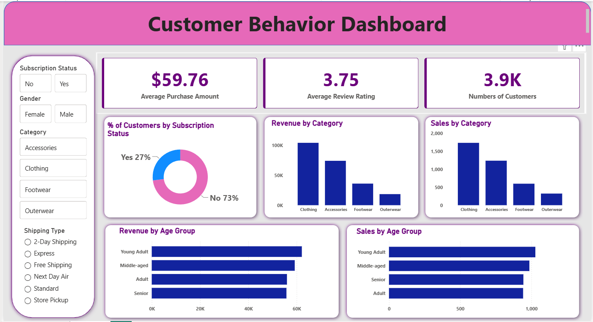

# 🛍️ Customer Shopping Behavior Analysis

A end-to-end data analysis project exploring customer shopping patterns using **Python (Pandas)**, **SQL**, and **Power BI**. The project covers the full data analysis pipeline — from data cleaning and exploration to SQL-based business queries and an interactive dashboard.

---

## 📌 Project Overview

This project analyzes a retail customer dataset of **3,900 customers** to uncover insights about purchasing behavior, revenue patterns, customer segmentation, and subscription trends. The goal is to help answer real business questions that a retail or e-commerce team would care about — who is buying, what they buy, how much they spend, and what drives loyalty.

**Dataset:** `customer_shopping_behavior.csv`  
**Records:** 3,900 customers  
**Features:** 18 columns including Age, Gender, Category, Purchase Amount, Review Rating, Subscription Status, Shipping Type, Payment Method, and more.

---

## 🗂️ Project Structure

```
Data_Analysis_Project/
│
├── customer_shopping_behavior.csv          # Raw dataset
├── Customer_Shopping_Behavior_Analysis.ipynb  # Python EDA & data cleaning (Jupyter Notebook)
├── customer_behavior_sql_queries.sql       # SQL business analysis queries
├── customer_behavior_dashboard.pbix        # Power BI interactive dashboard
├── Customer Shopping Behavior Analysis.pdf # Project report / documentation
├── Customer-Shopping-Behavior-Analysis.pptx  # Presentation slides
└── README.md
```

---

## 🔧 Tools & Technologies

| Tool | Purpose |
|------|---------|
| Python (Pandas) | Data loading, cleaning, EDA |
| Jupyter Notebook | Interactive analysis environment |
| SQL | Business questions & data querying |
| Power BI | Interactive dashboard & visualizations |

---

## 🧹 Part 1 — Data Cleaning & EDA (Python / Jupyter Notebook)

The notebook covers the complete data preparation and exploratory analysis workflow.

**Steps performed:**

- **Loaded the dataset** using Pandas and explored its shape and structure
- **Inspected data types** — 18 columns with a mix of `int64`, `float64`, and `object` types
- **Checked for missing values** — found 37 null values only in the `Review Rating` column
- **Handled missing values** — filled nulls using the **category-wise median** to preserve distribution integrity
  ```python
  df['Review Rating'] = df.groupby('Category')['Review Rating'].transform(
      lambda x: x.fillna(x.median())
  )
  ```
- **Renamed columns to snake_case** for consistency and easier querying
- **Descriptive statistics** — summarized key metrics across all numeric and categorical columns

**Key dataset facts discovered:**

| Metric | Value |
|--------|-------|
| Total Customers | 3,900 |
| Average Purchase Amount | $59.76 |
| Average Review Rating | 3.75 / 5.0 |
| Age Range | 18 – 70 years |
| Purchase Amount Range | $20 – $100 |
| Most Common Category | Clothing (1,737 purchases) |
| Most Used Payment Method | PayPal |
| Most Common Shipping Type | Free Shipping |
| Subscription Rate | 27% subscribed |

---

## 🗄️ Part 2 — SQL Business Analysis

10 business-driven SQL queries were written to extract actionable insights from the data.

| # | Question |
|---|----------|
| Q1 | Total revenue by gender (Male vs. Female) |
| Q2 | Customers who used discounts but still spent above average |
| Q3 | Top 5 products with the highest average review rating |
| Q4 | Average purchase amount: Standard vs. Express shipping |
| Q5 | Do subscribed customers spend more? (avg spend + total revenue comparison) |
| Q6 | Top 5 products with the highest discount usage rate |
| Q7 | Customer segmentation — New, Returning, and Loyal (based on previous purchases) |
| Q8 | Top 3 most purchased products within each category (using Window Functions) |
| Q9 | Are repeat buyers (>5 previous purchases) more likely to subscribe? |
| Q10 | Revenue contribution by age group |

**Techniques used:** `GROUP BY`, `HAVING`, Subqueries, `CASE WHEN`, `CTEs (WITH)`, Window Functions (`ROW_NUMBER() OVER PARTITION BY`)

---

## 📊 Part 3 — Power BI Dashboard

An interactive **Customer Behavior Dashboard** was built in Power BI to visualize the key findings.

### Dashboard Preview

<p align="center">
  
</p>

> *To view the live dashboard, open `customer_behavior_dashboard.pbix` in Power BI Desktop.*

### Dashboard Features

**KPI Cards (Top Row)**
- 💰 **$59.76** — Average Purchase Amount
- ⭐ **3.75** — Average Review Rating
- 👥 **3.9K** — Total Number of Customers

**Charts & Visuals**
- 🍩 **% of Customers by Subscription Status** — 73% non-subscribed vs. 27% subscribed
- 📊 **Revenue by Category** — Clothing leads, followed by Accessories, Footwear, Outerwear
- 📊 **Sales by Category** — Volume comparison across all 4 product categories
- 📊 **Revenue by Age Group** — Young Adults generate the highest revenue
- 📊 **Sales by Age Group** — Purchase volume comparison across Young Adult, Middle-aged, Adult, Senior

**Interactive Filters / Slicers**
- Subscription Status (Yes / No)
- Gender (Female / Male)
- Category (Accessories, Clothing, Footwear, Outerwear)
- Shipping Type (2-Day, Express, Free Shipping, Next Day Air, Standard, Store Pickup)

---

## 💡 Key Insights

- **Clothing** is the top-performing category in both revenue and sales volume
- **Young Adults** contribute the most revenue across all age groups
- Only **27%** of customers are subscribed — a significant opportunity for retention campaigns
- Customers who used discounts still spent at or above the average purchase amount — discounts don't cannibalize spend
- **Repeat buyers** (more than 5 previous purchases) show a strong correlation with subscription status
- **PayPal** is the most popular payment method among customers

---

## 📁 How to Explore This Project

1. **Python Analysis** — Open `Customer_Shopping_Behavior_Analysis.ipynb` in Jupyter Notebook or JupyterLab
2. **SQL Queries** — Open `customer_behavior_sql_queries.sql` in any SQL editor (MySQL, PostgreSQL, SQLite)
3. **Power BI Dashboard** — Open `customer_behavior_dashboard.pbix` in [Power BI Desktop](https://powerbi.microsoft.com/desktop/) (free)
4. **Presentation** — View `Customer-Shopping-Behavior-Analysis.pptx` for a summary of findings
5. **Report** — Read `Customer Shopping Behavior Analysis.pdf` for full documentation

---

## 👤 Author

**Amit Mahajan**  
Aspiring Data Analyst | Python • SQL • Power BI  

> Feel free to connect or reach out if you have questions about the project!

---

## 📄 License

This project is open for learning and portfolio purposes.
